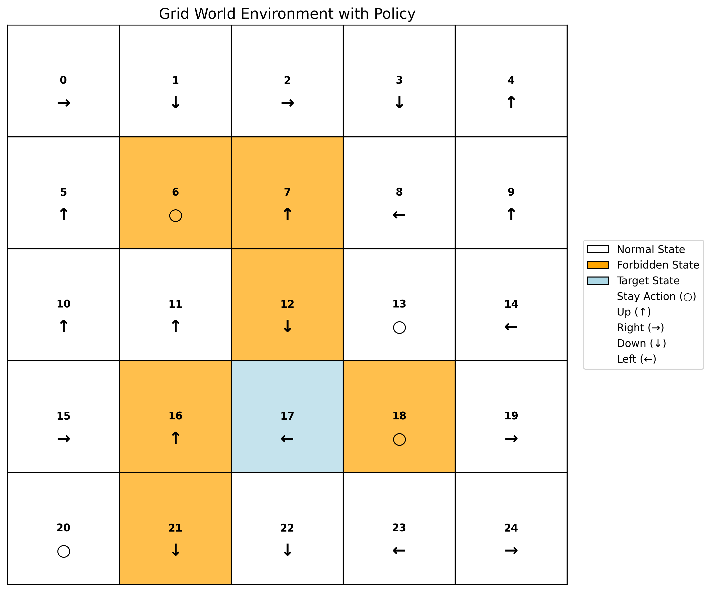
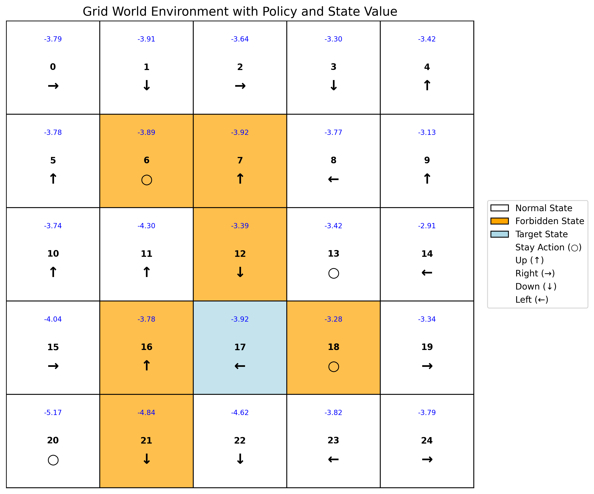

# Chapter 1: Grid World Environment

<div align="right">

[English](README_en.md) | [简体中文](README.md)

</div>

## Introduction

This chapter implements a basic Grid World reinforcement learning environment. Grid World is a classic benchmark environment in reinforcement learning, used for understanding and testing various reinforcement learning algorithms. This project implements a configurable Grid World environment model and provides functionalities for policy visualization and state-value function visualization, offering a unified benchmark environment for subsequent algorithm experiments.

## File Structure

```bash
Chapter1_Basic_Concepts/
├── results/ # Experiment results
│ ├── grid_world_policy.png # Policy iteration visualization
│ └── grid_world_policy_value.png # Value iteration visualization
├── src/ # Source code
│ ├── environment_model.py # Grid World environment model
│ ├── experiment.py # Main experiment file
│ └── visualization.py # Visualization utilities
└── scripts/ # Scripts directory
└── chapter1_experiment.sh # One-click experiment script
```

## Quick Start
```bash
bash Chapter1_Basic_Concepts/scripts/chapter1_experiment.sh
```

## Parameter Description

The following are the main parameters used in the experiment script and their meanings:

| Parameter | Value | Description |
|---|---|---|
| **SIZE** | 5 | Dimension of the square grid world (rows and columns), creating a 5×5 grid here |
| **GAMMA** | 0.9 | Future reward discount factor in reinforcement learning, value between 0-1, closer to 1 indicates greater emphasis on future rewards |
| **ACTIONS** | "up right down left stay" | Set of actions the agent can take, "stay" means remain in the current cell |
| **FORBIDDEN_STATES** | "6 7 12 16 18 21" | Entering these states will incur a penalty |
| **TARGET_STATES** | "17" | Target state index list, reaching these states will receive a reward |
| **R_BOUND** | -1 | Immediate reward when the agent's action would move it out of the grid boundary (hit a wall), a penalty for invalid movement |
| **R_FORBID** | -1 | Immediate reward when the agent enters a forbidden state, a penalty for entering a dangerous area |
| **R_TARGET** | 1 | Immediate reward when the agent reaches a target state, a positive reward for achieving the goal |
| **R_DEFAULT** | 0 | Default immediate reward for any other valid transition (moving to a non-target, non-forbidden cell) |
| **SEED** | 42 | Random seed value for initializing the pseudo-random number generator, ensuring reproducibility of experimental results |

## Experiment Results
The experiment will generate two visualizations, showing a random policy and its corresponding state values:

### Random Policy Visualization


### State Values under Random Policy


