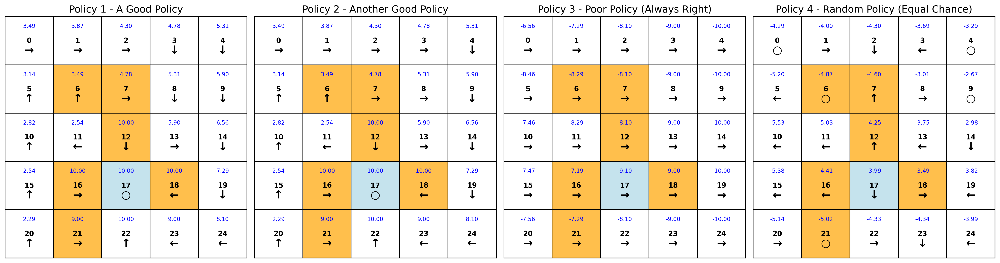

##  贝尔曼方程介绍

本章节实现了贝尔曼方程的两种形式（向量式和迭代式），在网格世界（Grid World）中给定1中随机化策略和三个确定性策略，可视化每种策略的状态值。包括可配置的网格世界环境模型，并提供了可视化的功能。

## 文件结构

```bash
Chapter2_Bellman_Equations/
├── results/                        # 实验结果
│   ├── grid_world_policy_comparison_closed.png    # 闭式解（向量式）结果
│   └── grid_world_policy_comparison_iterative.png  # 迭代式结果
├── src/                           # 源代码
│   ├── algorithms/               # 算法实现
│   │   └── bellman_equation.py   # 贝尔曼方程实现
│   ├── experiment.py             # 实验主文件
│   └── visualization.py          # 可视化工具
└── scripts/                      # 运行脚本目录
    └── chapter2_experiment.sh    # 一键运行实验脚本
```

##  快速开始

```bash
bash Chapter2_Bellman_Equations/scripts/chapter2_experiment.sh
```

## 实验结果
实验将生成两个可视化图表，展示每种贝尔曼方程的形式下求解的策略对应的状态值：

### 闭式解结果可视化


### 迭代式结果可视化


