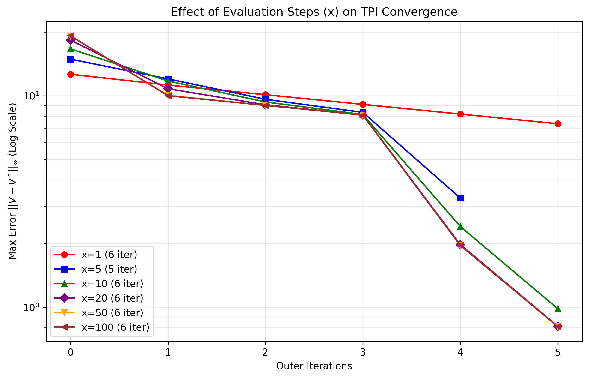

# 章节3：值迭代和策略迭代方法

<div align="right">

[English](README_en.md) | [简体中文](README.md)

</div>

## 介绍

### **值迭代算法**

该算法通过不断迭代更新状态价值函数，并在迭代收敛后一次性提取最优策略。其核心是贝尔曼最优方程的直接应用。

### **策略迭代算法**

该算法分为“策略评估”和“策略改进”两个步骤交替进行。它首先固定策略并评估其价值函数，然后基于该价值函数对策略进行贪婪改进，直至策略收敛。

### **截断策略迭代**

此算法是策略迭代的一种高效变体。它在“策略评估”步骤中并不追求完全收敛的价值函数，而是仅进行固定次数的迭代（即“截断”）后，便直接转入“策略改进”步骤，从而在计算效率和精度之间取得平衡。


### **实现内容**

本章节在网格世界（Grid World）环境中实现了以下内容：

1.  **三种迭代算法实现**：完整实现了值迭代、策略迭代和截断策略迭代算法
2.  **最优策略求解**：应用三种算法分别求解网格世界环境的最优策略
3.  **状态值可视化**：可视化展示每种算法求得的最优策略对应的状态价值函数
4.  **环境配置灵活性**：网格世界环境参数（如网格大小、障碍物位置、奖励惩罚值、折扣因子、终止状态等）支持灵活配置
5.  **对比分析**：通过可视化结果对比分析三种算法在收敛速度、计算效率和最终策略质量等方面的差异


## 文件结构

```bash
Chapter3_Policy_and_Value_Iteration/ # 第三章主目录
├── results/ # 实验结果目录
│ ├── convergence_comparison_S0.png # 三种算法在状态S0的收敛曲线对比
│ ├── policy_comparison.png # 三种算法求得的最优策略可视化对比
│ └── TPI_error_vs_x.png # 截断策略迭代中误差与截断参数x的关系
├── scripts/ # 脚本目录
│ └── chapter3_experiment.sh # 一键运行所有实验的脚本
└── src/ # 源代码目录
├── algorithms/ # 算法实现
│ ├── dpsolver.py # 动态规划求解器基类
│ ├── policy_iteration.py # 策略迭代算法实现
│ ├── truncated_policy_iteration.py # 截断策略迭代算法实现
│ └── value_iteration.py # 值迭代算法实现
├── experiment.py # 实验配置与运行主程序
└── visualization.py # 可视化工具（策略、状态值、收敛曲线等）
```

##  快速开始

```bash
bash Chapter3_Policy_and_Value_Iteration/scripts/chapter3_experiment.sh
```

## 实验结果
实验将生成三个个可视化图表，分别为三种算法收敛迭代轮数和状态值之间变化曲线、不同内部循环次数截断策略迭代算法迭代次数和误差曲线和三种算法对应的最佳策略：

### 收敛迭代轮数和状态值之间变化曲线可视化


### 截断策略迭代算法不同内部循环次数下收敛的迭代次数可视化



### 三种算法对应的最佳策略及其状态值可视化


