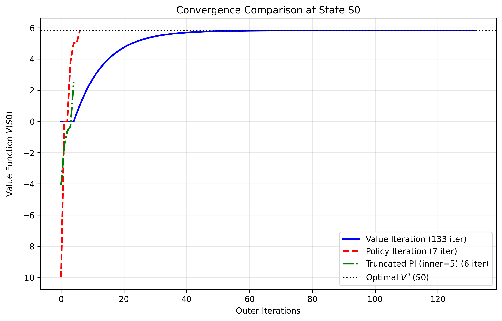
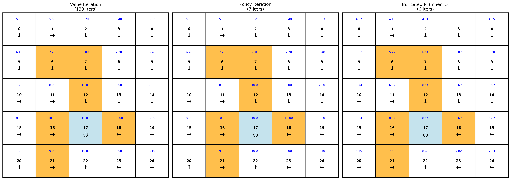

##  值迭代和策略迭代实验

本章节实现了求解最佳策略的三种迭代算法（值迭代、策略迭代和截断策略迭代），并在网格世界（Grid World）中可视化每种方法最后学到的策略及其状态值。包括可配置的网格世界环境模型，并提供了可视化的功能。

## 文件结构

```bash
Chapter3_Policy_and_Value_Iteration/
├── results/
│   ├── convergence_comparison_S0.png
│   ├── policy_comparison.png
│   └── TPI_error_vs_x.png
├── scripts/
│   └── chapter3_experiment.sh
└── src/
    ├── algorithms/
    │   ├── dpsolver.py
    │   ├── policy_iteration.py
    │   ├── truncated_policy_iteration.py
    │   └── value_iteration.py
    ├── experiment.py
    └── visualization.py
```

##  快速开始

```bash
bash Chapter3_Policy_and_Value_Iteration/scripts/chapter3_experiment.sh
```

## 实验结果
实验将生成三个个可视化图表，分别为三种算法收敛迭代轮数和状态值之间变化曲线、不同内部循环次数截断策略迭代算法迭代次数和误差曲线和三种算法对应的最佳策略：

### 收敛迭代轮数和状态值之间变化曲线可视化



### 截断策略迭代算法不同内部循环次数下收敛的迭代次数可视化


### 三种算法对应的最佳策略及其状态值可视化



