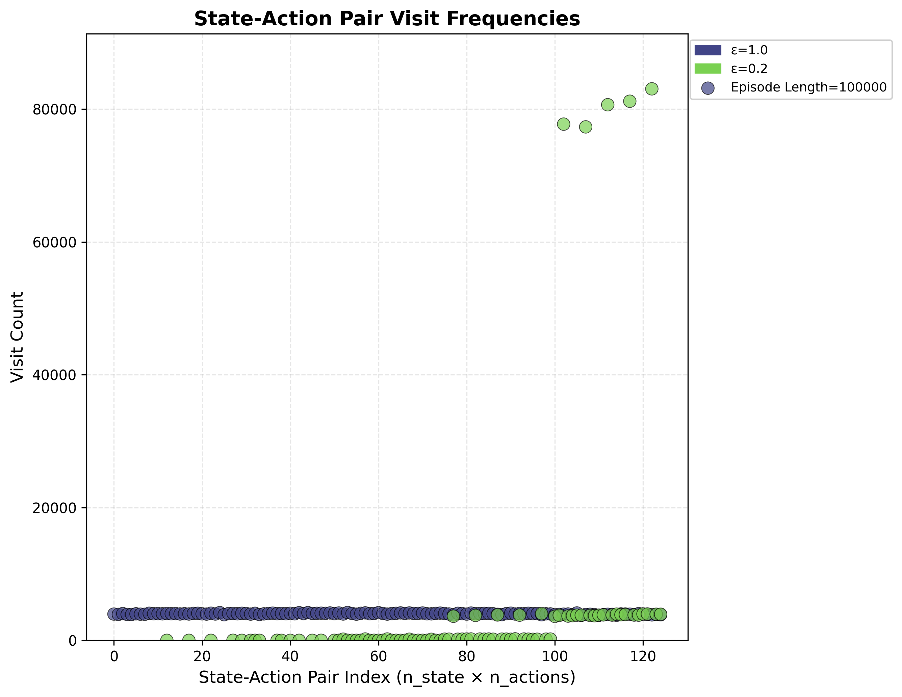

# 章节4：蒙特卡洛算法实验

<div align="right">

[English](README_en.md) | [简体中文](README.md)

</div>

## 介绍

### **蒙特卡洛算法基础**

蒙特卡洛方法通过从环境中采样完整的轨迹（episode）来估计状态的价值和优化策略，与基于动态规划的算法不同，它不需要环境的完整模型知识，仅依赖与环境的交互经验。

### **MC Basic (基本蒙特卡洛控制)**
- 基于每次访问的蒙特卡洛更新
- 无ε-greedy探索机制
- 固定策略评估

### **MC Exploring Starts (探索起点蒙特卡洛)**
- 每个episode从随机的状态-动作对开始
- 保证对状态-动作空间的充分探索
- 采用贪婪策略改进

### **MC ε-greedy (ε-贪心蒙特卡洛)**
- 平衡探索与利用的ε-greedy策略
- 可调节的探索率ε
- 增量式策略改进


### **实现内容**

本章节在网格世界（Grid World）环境中实现了以下内容：

1.  **三种算法实现**：完整实现了MC Basic、MC Exploring Starts和MC ε-greedy算法
2.  **策略与价值可视化**：在网格世界中可视化每种方法最后学到的策略及其对应的状态价值函数
3.  **可配置环境模型**：网格世界环境参数（如网格大小、障碍物位置、奖励值、终止状态等）支持灵活配置
4.  **ε值对比分析**：针对不同的ε值，可视化蒙特卡洛ε-greedy算法的学习曲线和性能散点图，分析探索-利用权衡的影响
5.  **轨迹采样与分析**：展示算法采样的完整轨迹，分析不同采样策略对学习效果的影响
6.  **收敛性对比**：比较三种蒙特卡洛方法在收敛速度和最终策略质量方面的差异


## 文件结构

```bash
Chapter4_Monte_Carlo/
├── results/ # 结果可视化文件目录
│ ├── mc_policy_comparison.png # 三种算法策略对比图
│ └── state_action_visit_scatter.png # 探索特性分析散点图
├── scripts/ # 实验脚本目录
│ └── chapter4_experiment.sh # 主实验脚本，一键运行所有实验
└── src/ # 源代码目录
├── algorithms/ # 算法实现模块
│ ├── mc_basic.py # MC Basic 算法实现
│ ├── mc_epsilon_greedy.py # MC ε-greedy 算法实现
│ └── mc_exploring_starts.py # MC Exploring Starts 算法实现
├── experiment.py # 实验运行和参数配置主文件
└── visualization.py # 数据可视化和图表生成模块
```

##  快速开始

```bash
bash Chapter4_Monte_Carlo/scripts/chapter4_experiment.sh
```
## 参数配置

以下是实验中使用的参数及其默认配置：

| 参数 | 值 | 说明 |
|------|-----|------|
| **GridWorld 环境配置** | | |
| **SIZE** | 5 | 网格世界的维度，创建 5×5 的方形网格 |
| **GAMMA** | 0.9 | 未来奖励的折扣因子，取值范围 0-1，值越高表示越重视未来奖励 |
| **FORBIDDEN_STATES** | "6 7 12 16 18 21" | 禁止进入的状态列表 |
| **TARGET_STATES** | "17" | 目标/终止状态列表，到达这些状态时回合结束 |
| **R_BOUND** | -1 | 撞到网格边界时获得的即时奖励 |
| **R_FORBID** | -1 | 进入禁止状态时获得的即时奖励 |
| **R_TARGET** | 1 | 到达目标状态时获得的即时奖励 |
| **R_DEFAULT** | 0 | 正常状态转移时的默认即时奖励 |
| **MC Basic 算法配置** | | |
| **MC_BASIC_EPISODE_LENGTH** | 10 | 每个 episode 的最大步数限制 |
| **MC_BASIC_ITERATIONS** | 100 | 算法训练的总迭代次数 |
| **MC Exploring Starts 算法配置** | | |
| **MC_ES_EPISODE_LENGTH** | 10 | 每个 episode 的最大步数限制 |
| **MC_ES_ITERATIONS** | 10000 | 算法训练的总迭代次数 |
| **MC ε-greedy 算法配置 (ε=0.1)** | | |
| **MC_EPS1_EPISODE_LENGTH** | 1000 | 每个 episode 的最大步数限制 |
| **MC_EPS1_EPSILON** | 0.1 | 探索率参数，控制探索与利用的平衡 |
| **MC_EPS1_ITERATIONS** | 100 | 算法训练的总迭代次数 |
| **MC ε-greedy 算法配置 (ε=0.2)** | | |
| **MC_EPS2_EPISODE_LENGTH** | 1000 | 每个 episode 的最大步数限制 |
| **MC_EPS2_EPSILON** | 0.2 | 探索率参数，控制探索与利用的平衡 |
| **MC_EPS2_ITERATIONS** | 100 | 算法训练的总迭代次数 |
| **探索特性分析配置** | | |
| **MC_EPISODE_LENGTH** | 100000 | 散点图分析时使用的总步数 |
| **MC_EPS_EPSILON1** | 1.0 | 第一个探索率参数（完全探索） |
| **MC_EPS_EPSILON2** | 0.2 | 第二个探索率参数（部分探索） |

## 实验结果

实验将展示**两种对比分析可视化结果**，以综合呈现三种算法的学习效果与探索特性。

1.  **策略对比可视化** (共四个子图)
    -   **MC Basic** 算法学习到的最终策略
    -   **MC Exploring Starts** 算法学习到的最终策略
    -   **MC ε-greedy** 算法（参数ε1）学习到的最终策略
    -   **MC ε-greedy** 算法（参数ε2）学习到的最终策略

    *可视化将呈现不同算法在相同网格世界中最终学到的动作选择策略，便于进行直观对比。*

2.  **探索特性分析可视化**
    -   展示不同ε值下MC ε-greedy算法在探索过程中访问各状态-动作对的次数分布
    -   帮助分析探索策略对算法性能和学习效率的影响


### 三种算法最佳策略及其状态值对比


### 不同ε值下状态-动作对访问频率散点图
- 展示ε=1.0（完全探索）和ε=0.2（部分探索）下的探索行为差异
- 横轴：状态-动作对索引
- 纵轴：访问次数

