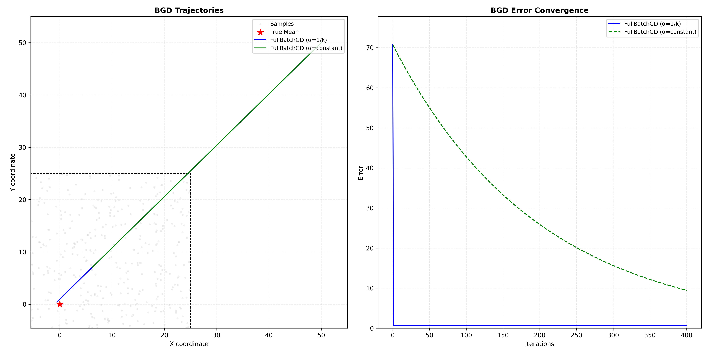
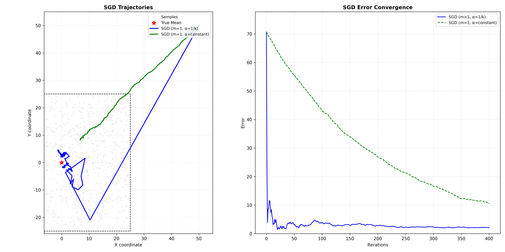
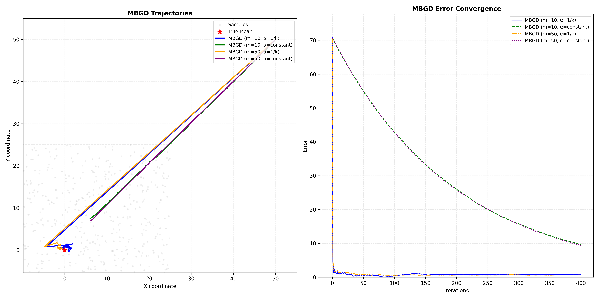

# 章节5：随机近似算法

<div align="right">

[English](README_en.md) | [简体中文](README.md)

</div>

## 介绍

### **随机近似算法基础**

随机近似（Stochastic Approximation）是一种处理随机优化问题的强大方法，特别适用于具有不确定性或随机噪声的强化学习环境。与确定性优化方法不同，它通过引入随机采样来处理非精确的梯度信息，从而在复杂环境中实现高效优化。

### **批量梯度下降（BGD）**
- 每次迭代使用全部训练样本计算梯度
- 梯度更新方向稳定，收敛路径平滑
- 计算开销大，内存需求高
- 适用于小规模数据集

### **随机梯度下降（SGD）**
- 每次迭代使用单个样本计算梯度
- 梯度更新具有高方差，收敛路径震荡
- 计算效率高，内存需求低
- 适用于大规模在线学习场景

### **小批量梯度下降（MBGD）**
- 每次迭代使用一小批样本计算梯度
- 在SGD的效率和BGD的稳定性之间取得平衡
- 可并行化计算，充分利用硬件资源
- 广泛应用于深度学习实践

### 算法实现

本章节在二维平面散点图求均值问题上实现了以下三种随机近似方法：

1.  **BGD算法实现**：完整的批量梯度下降实现，展示确定性优化过程
2.  **SGD算法实现**：随机梯度下降算法，体现高方差梯度更新的特性
3.  **MBGD算法实现**：小批量梯度下降算法，平衡收敛速度和稳定性


## 文件结构

```bash
Chapter5_Stochastic_Approximation/
├── results/                    # 主实验结果存储目录
│   ├── BGD_results.png        # 批量梯度下降算法结果图
│   ├── MBGD_results.png       # 小批量梯度下降算法结果图
│   └── SGD_results.png        # 随机梯度下降算法结果图
├── scripts/                    # 实验脚本
│   └── chapter5_experiment.sh  # 用于运行实验的脚本
├── src/                        # 源代码目录
│   ├── environment.py         # 环境定义
│   ├── experiment.py         # 实验逻辑实现
│   ├── visualization.py      # 可视化工具
│   ├── algorithms/           # 算法实现目录
│   │   ├── bgd.py           # 批量梯度下降算法
│   │   ├── mbgd.py          # 小批量梯度下降算法
│   │   └── sgd.py           # 随机梯度下降算法
└── README.md                 # 项目说明文档
```

## 快速开始

### 运行命令

```bash
bash Chapter5_Stochastic_Approximation/scripts/chapter5_experiment.sh
```
  
## 参数配置

以下是实验中使用的关键参数及其含义：

| 参数 | 默认值 | 说明 |
|------|--------|------|
| **实验环境参数** | | |
| **SQUARE_SIZE** | 50.0 | 均匀分布的正方形边长 |
| **NUM_SAMPLES** | 1000 | 生成的总样本数量 |
| **TOTAL_ITERATIONS** | 400 | 优化的总迭代次数 |
| **INIT_X** | 50.0 | 初始点的x坐标 |
| **INIT_Y** | 50.0 | 初始点的y坐标 |
| **梯度下降参数** | | |
| **BATCH_SIZES** | "10 50" | 小批量梯度下降的批次大小（可指定多个） |
| **CONSTANT_ALPHA** | 0.005 | 恒定学习率大小 |

### 参数调整

可以通过修改 `scripts/chapter5_experiment.sh` 文件中的参数来调整实验设置。例如：
- **学习率（learning rate）**：调整梯度下降算法的学习率。
- **批量大小（batch size）**：在小批量梯度下降（MBGD）中设置每次更新的样本数量。
- **迭代次数（iterations）**：设置每种算法的最大迭代次数。


## 实验结果

实验将生成 **3个独立的可视化结果**，分别对应三种梯度下降算法（BGD, SGD, MBGD）。每个算法的结果图中包含**2个子图**，分别展示优化路径和误差收敛过程，以便进行直观比较。

### 可视化内容

1.  **优化路径轨迹图**
    -   **展示内容**：算法在二维平面空间中的优化路径
    -   **对比维度**：
        -   **恒定学习率**: 固定学习率下的优化轨迹
        -   **变化学习率**: 如随迭代衰减学习率下的优化轨迹
    -   **作用**：直观展示算法在二维平面空间中如何从初始点逐步逼近最优解，以及不同学习率对搜索效率的影响。

2.  **误差收敛图**
    -   **展示内容**：目标函数误差（损失）随迭代次数的下降曲线
    -   **对比维度**：
        -   **恒定学习率**: 固定学习率下的误差下降趋势
        -   **变化学习率**: 如随迭代衰减学习率下的误差下降趋势
    -   **作用**：定量分析算法的收敛速度、稳定性和最终精度，评估不同学习率对误差收敛的效果。


### BGD 轨迹与误差收敛


### SGD 轨迹与误差收敛


### MBGD 轨迹与误差收敛

