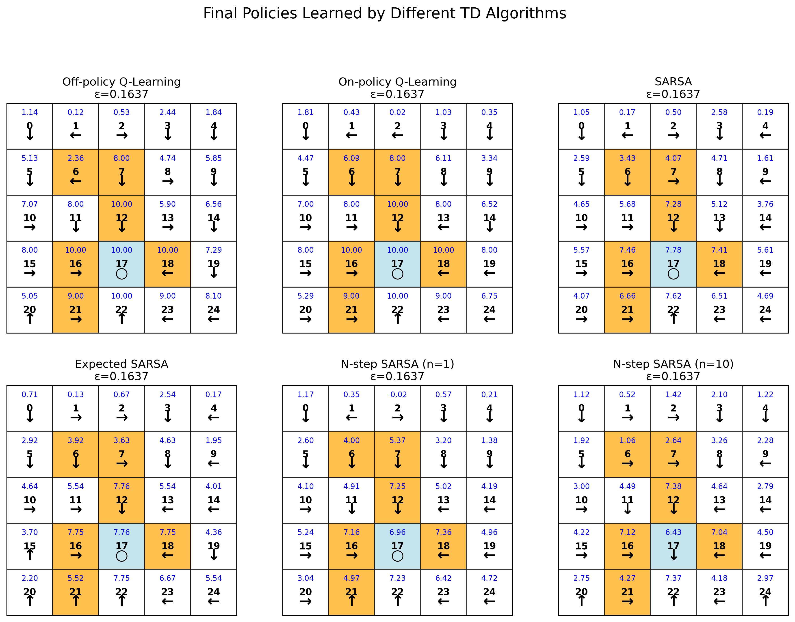
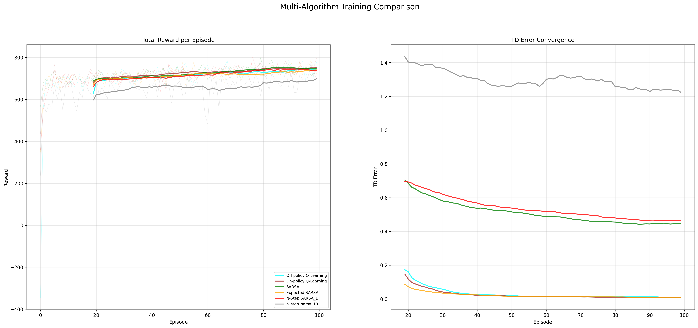

# 章节6：时序差分（TD）算法实验

<div align="right">

[English](README_en.md) | [简体中文](README.md)

</div>

## 介绍

### **时序差分算法基础**

时序差分（Temporal Difference, TD）方法是强化学习中一类核心的无模型学习算法，结合了蒙特卡洛方法和动态规划的思想。它们通过自助法（bootstrapping）进行学习——基于其他已学习的估计来更新当前估计，而不需要环境的完整模型。

### **SARSA (状态-动作-奖励-状态-动作)**
- 标准在线策略TD控制算法
- 遵循ε-贪心探索策略
- 使用当前策略选择的动作进行价值更新
- 适用于在线学习场景

### **Expected SARSA (期望式SARSA)**
- 基于期望的TD控制算法
- 使用所有可能动作的期望价值进行更新
- 通常比标准SARSA更稳定
- 减少方差，提高学习效率

### **N-step SARSA**
- 多步TD控制算法
- 结合n步回报进行更新
- 平衡即时回报和长期回报
- 可调节步数参数n控制偏差-方差权衡

### **在线策略Q-Learning (On-policy Q-Learning)**
- 基于ε-贪心策略的Q学习算法
- 行为策略与目标策略相同
- 在探索和利用间取得平衡
- 适用于需要持续探索的环境

### **离线策略Q-Learning (Off-policy Q-Learning)**
- 标准Q学习算法
- 行为策略与目标策略分离
- 学习最优策略而不考虑探索策略
- 具有收敛到最优策略的理论保证

### 算法实现

本章节在网格世界（Grid World）环境中实现了以下五种时序差分算法以求解最佳策略：

1.  **SARSA算法实现**：标准在线策略TD控制算法
2.  **Expected SARSA算法实现**：基于期望的TD控制算法
3.  **N-step SARSA算法实现**：多步TD控制算法
4.  **在线策略Q-Learning实现**：ε-贪心策略的Q学习
5.  **离线策略Q-Learning实现**：标准Q学习算法

## 文件结构

```bash
Chapter6_Temporal_Difference/
├── results/ # 实验结果存储目录
│ ├── final_policies_comparison.png # 最终策略对比图
│ └── multi_algorithm_comparison.png # 多算法训练曲线对比图
├── scripts/ # 实验脚本目录
│ └── chapter6_experiment.sh # 主实验脚本
└── src/ # 源代码目录
├── algorithms/ # 算法实现模块
│ ├── expected_sarsa.py # Expected SARSA算法实现
│ ├── n_step_sarsa.py # N-step SARSA算法实现
│ ├── off_policy_qlearning.py # 离线策略Q-Learning实现
│ ├── on_policy_qlearning.py # 在线策略Q-Learning实现
│ └── sarsa.py # SARSA算法实现
├── experiment.py # 实验运行和参数配置主文件
└── visualization.py # 数据可视化和图表生成模块
```

## 快速开始


```bash
bash Chapter6_Temporal_Difference/scripts/chapter6_experiment.sh
```


## 参数配置

以下是实验中使用的关键参数及其含义：

| 参数 | 默认值 | 说明 |
|------|--------|------|
| **GridWorld 环境配置** | | |
| **SIZE** | 5 | 网格世界的维度，创建 5×5 的方形网格 |
| **GAMMA** | 0.9 | 未来奖励的折扣因子 |
| **FORBIDDEN_STATES** | "6 7 12 16 18 21" | 禁止进入的状态列表 |
| **TARGET_STATES** | "17" | 目标/终止状态列表 |
| **R_BOUND** | -1 | 撞到网格边界时获得的即时奖励 |
| **R_FORBID** | -1 | 进入禁止状态时获得的即时奖励 |
| **R_TARGET** | 1 | 到达目标状态时获得的即时奖励 |
| **R_DEFAULT** | 0 | 正常状态转移时的默认即时奖励 |
| **算法训练参数** | | |
| **NUM_EPISODES** | 100 | 训练的总回合数 |
| **MAX_STEPS** | 1000 | 每个回合的最大步数限制 |
| **算法超参数** | | |
| **LEARNING_RATE** | 0.1 | 学习率参数，控制每次更新的幅度 |
| **EPSILON** | 0.2 | 初始探索率参数（ε-greedy策略） |
| **EPSILON_DECAY** | 0.998 | 探索率衰减系数，每回合衰减比例 |
| **EPSILON_MIN** | 0.01 | 探索率的最小值 |
| **N-step SARSA参数** | | |
| **N_STEPS** | "1 10" | N-step SARSA算法的步数参数列表（可测试两种步数） |


## 实验结果

实验将生成两种综合可视化结果，从多个维度对比分析五种TD算法的学习性能。

### 1. 多算法策略与状态值对比图 (6个子图)
每个子图展示一个TD算法在5×5网格世界中的学习结果，包含：
- **网格结构**：清晰显示5×5的网格布局
- **状态值标注**：每个单元格中心显示该状态的估计价值（数值格式）
- **策略箭头**：每个单元格通过箭头方向表示学到的策略（上/下/左/右/停留）
- **特殊状态标记**：
  - 目标状态：蓝色显示
  - 禁止状态：橙色显示

**具体包含以下6个子图**：
1. **SARSA算法结果**：标准在线策略TD学习
2. **Expected SARSA算法结果**：基于期望的TD学习
3. **N-step SARSA (n=1)算法结果**：单步时序差分
4. **N-step SARSA (n=10)算法结果**：十步时序差分
5. **在线策略Q-Learning结果**：ε-贪心策略学习
6. **离线策略Q-Learning结果**：最优策略学习

展示五种TD算法在相同训练条件下学到的最终策略及其对应的状态价值函数：


*该图直观对比不同算法在相同环境下学到的具体策略选择与状态价值估计。*

### 2. 多算法训练过程对比图 (2个子图)
- **左侧子图：总奖励收敛曲线**
  - 展示五种算法在每个训练回合中获得的总奖励
  - 包含移动平均线和平滑处理
  - 比较不同算法的收敛速度和最终性能

- **右侧子图：TD误差收敛曲线**
  - 展示五种算法在每个训练回合中的平均TD误差
  - 反映算法对价值函数估计的改进过程
  - 分析不同算法的学习稳定性
  - 
展示五种TD算法在训练过程中的性能指标变化：


