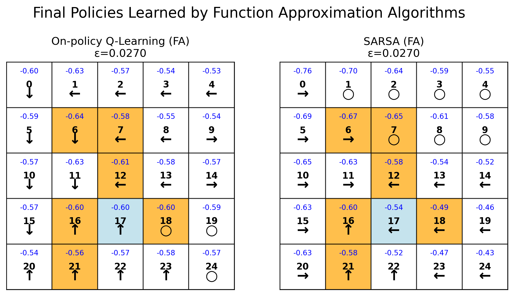
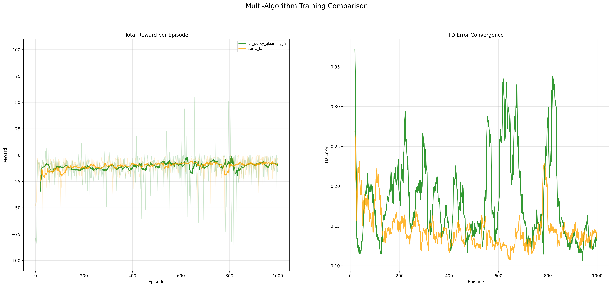

# 章节7：值函数逼近实验

本章节实现并比较了若干基于函数逼近的值函数学习与控制方法（线性特征的 TD、基于特征的 Q-learning / SARSA 等），并在网格世界（Grid World）环境中可视化每种方法学到的状态值与策略。支持可配置的环境、特征抽取器和可视化输出，便于多算法比较与训练曲线分析。

<div align="right">

[English](README_en.md) | [简体中文](README.md)

</div>

## 介绍

### **值函数逼近基础**

在状态空间庞大或连续的情况下，传统的表格型（Tabular）强化学习方法（如之前章节的TD算法）会因存储和泛化能力不足而失效。值函数逼近（Value Function Approximation, VFA）是解决这一问题的核心技术，它通过参数化的函数（如线性函数、神经网络）来近似表示状态值函数 V(s) 或动作值函数 Q(s, a)。本章节聚焦于基于线性特征的逼近方法，该方法将高维状态映射到低维特征空间，通过更新权重来学习值函数，从而实现对大规模或连续状态空间的泛化。

### **线性时序差分（Linear TD）算法**
- 使用线性特征的TD(0)和TD(λ)方法
- 通过特征向量与权重向量的点积来逼近状态值
- 更新权重而非每个独立的状态值，实现高效学习
- 适用于大规模状态空间下的策略评估

### **基于特征的Q-Learning（Feature-based Q-Learning）**
- 将Q-Learning算法与线性函数逼近相结合
- 通过特征表示状态-动作对，学习最优动作值函数
- 使用ε-贪心策略进行探索
- 适用于高维离散或低维连续状态空间的控制问题

### **基于特征的SARSA（Feature-based SARSA）**
- 在线策略的SARSA算法与线性函数逼近结合
- 使用当前策略选择的动作进行Q值更新
- 在学习过程中直接优化行为策略
- 在需要平衡探索与利用的在线控制场景中表现稳定

### **特征提取器（Feature Extractor）**
- 核心模块，负责将原始状态（如网格坐标）转换为特征向量
- 实现 **多项式特征（Polynomial）** 来捕获状态分量间的交互

 
## 文件结构

```bash
Chapter7_Value_Function_Approximation/
├── experiment_one_results/         # 实验一结果存储目录
│   ├── 3d_state_values.png         # 3D状态值可视化
│   ├── comparison_summary.png       # 综合对比图
│   ├── ground_truth_3d.png          # 真实值3D可视化
│   └── rmse_curves_500_episodes.png # RMSE误差曲线图
│
├── experiment_two_results/          # 实验二结果存储目录
│   ├── final_policies_comparison.png  # 最终策略对比图
│   └── multi_algorithm_comparison.png # 多算法训练对比图
│
├── scripts/                         # 脚本目录
│   ├── chapter7_experiment_one.sh   # 实验一运行脚本
│   └── chapter7_experiment_two.sh   # 实验二运行脚本
│
├── src/                             # 源代码目录
│   ├── experiment_one/              # 实验一模块
│   │   ├── algorithms/              # 算法子目录
│   │   │   ├── __init__.py
│   │   │   ├── bellman_iteration.py
│   │   │   ├── feature_extractor.py
│   │   │   ├── policy_generator.py
│   │   │   └── td_linear.py
│   │   ├── experiment.py            # 实验一运行和参数配置主文件
│   │   └── visualization.py         # 实验一数据可视化和图表生成模块
│   │
│   └── experiment_two/              # 实验二模块
│       ├── algorithms/              # 算法模块
│       │   ├── __init__.py
│       │   ├── feature_extractor.py
│       │   ├── qlearning_agent.py
│       │   └── sarsa_agent.py
│       ├── experiment.py            # 实验二运行和参数配置主文件
│       └── visualization.py        # 实验二数据可视化和图表生成模块
│
└── README.md                        # 项目说明文档
```

## 快速开始

### 实验一
运行实验一，比较线性TD在给定随机策略下的值函数逼近效果:

```bash
bash Chapter7_Value_Function_Approximation/scripts/chapter7_experiment_one.sh
```

以下是实验中使用的关键参数及其含义：

| 参数 | 默认值 | 说明 |
|------|--------|------|
| **GridWorld 环境配置** | | |
| **SIZE** | 5 | 网格世界的维度，创建 5×5 的方形网格 |
| **GAMMA** | 0.9 | 未来奖励的折扣因子，控制未来奖励的重要性 |
| **FORBIDDEN_STATES** | "6 7 12 16 18 21" | 禁止进入的状态列表（从0开始计数） |
| **TARGET_STATES** | "17" | 目标/终止状态列表，到达后回合结束 |
| **R_BOUND** | -1 | 撞到网格边界时获得的即时奖励 |
| **R_FORBID** | -1 | 进入禁止状态时获得的即时奖励 |
| **R_TARGET** | 1 | 到达目标状态时获得的即时奖励 |
| **R_DEFAULT** | 0 | 正常状态转移时的默认即时奖励 |
| **实验一算法训练参数** | | |
| **N_EPISODES** | 500 | 训练的总回合数 |
| **LEARNING_RATE** | 0.001 | 学习率参数，控制每次更新的幅度 |
| **SEED** | 42 | 随机种子，确保实验可重复性 |

### 实验二
运行实验二，比较基于特征的Q-Learning和SARSA在网格世界中的在线学习性能：

```bash
bash Chapter7_Value_Function_Approximation/scripts/chapter7_experiment_two.sh
```
以下是实验二使用的关键参数及其含义：

| 参数 | 默认值 | 说明 |
|------|--------|------|
| **GridWorld 环境配置** | | |
| **SIZE** | 5 | 网格世界的维度，创建 5×5 的方形网格 |
| **GAMMA** | 0.9 | 未来奖励的折扣因子，控制未来奖励的重要性 |
| **FORBIDDEN_STATES** | "6 7 12 16 18 21" | 禁止进入的状态列表（从0开始计数） |
| **TARGET_STATES** | "17" | 目标/终止状态列表，到达后回合结束 |
| **R_BOUND** | -1 | 撞到网格边界时获得的即时奖励 |
| **R_FORBID** | -1 | 进入禁止状态时获得的即时奖励 |
| **R_TARGET** | 1 | 到达目标状态时获得的即时奖励 |
| **R_DEFAULT** | 0 | 正常状态转移时的默认即时奖励 |
| **算法训练参数** | | |
| **NUM_EPISODES** | 1000 | 训练的总回合数 |
| **MAX_STEPS** | 100 | 每个回合的最大步数限制 |
| **算法超参数** | | |
| **LEARNING_RATE** | 0.0005 | 学习率参数，控制每次更新的幅度 |
| **EPSILON** | 0.2 | 初始探索率参数（ε-greedy策略） |
| **EPSILON_DECAY** | 0.998 | 探索率衰减系数，每回合衰减比例 |
| **EPSILON_MIN** | 0.01 | 探索率的最小值 |

## 实验结果

### 实验一结果

在给定固定随机策略的情况下，使用线性函数逼近来评估状态值函数，并与真实值（通过贝尔曼方程计算）进行比较。实验一将生成以下可视化结果，用于分析线性TD算法的逼近性能：

#### 1. 综合对比图
展示线性TD(0)和TD(λ)学到的状态值与真实值的对比：


#### 2. 3D状态值可视化
三维展示不同方法学到的状态值分布：
- **真实值3D图**：通过贝尔曼方程计算的精确状态值

- **逼近值3D图**：线性TD算法学到的状态值


#### 3. RMSE误差曲线
展示训练过程中逼近误差的变化，比较不同算法的收敛速度：


### 实验二结果
**注意⚠️**：当前基于线性特征的在线控制算法在网格世界环境中学习最优策略时存在收敛性问题，学到的策略可能不是最优的。这主要是由于线性函数逼近的表达能力有限，在网格世界这种离散环境中，表格型方法可能更为合适。特征选择和逼近误差可能导致策略学习不充分。
在未知环境动态的情况下，通过与环境在线交互，使用基于线性特征逼近的算法学习最优策略。实验二将生成以下可视化结果，用于比较基于特征的在线控制算法：

#### 1. 多算法策略与状态值对比
展示Q-Learning和SARSA学到的最终策略及其对应的状态值函数：


#### 2. 多算法训练过程对比
展示两种算法在训练过程中的性能指标变化：
- **左侧子图**：每回合总奖励的收敛曲线
- **右侧子图**：训练过程TD error收敛曲线

