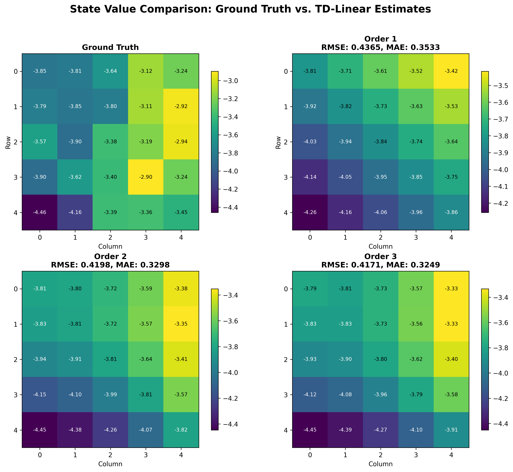
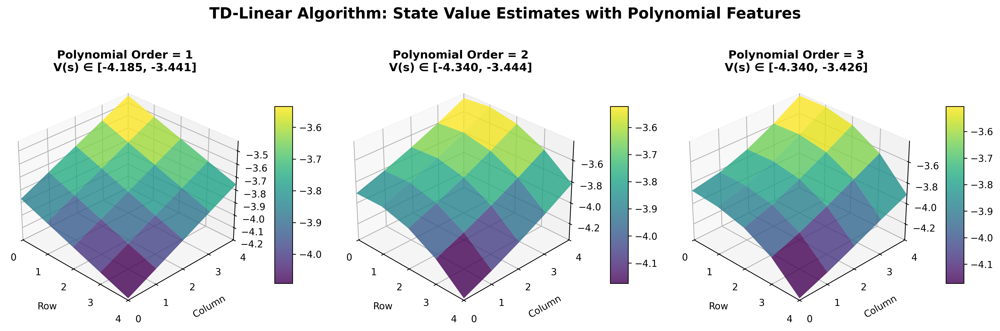
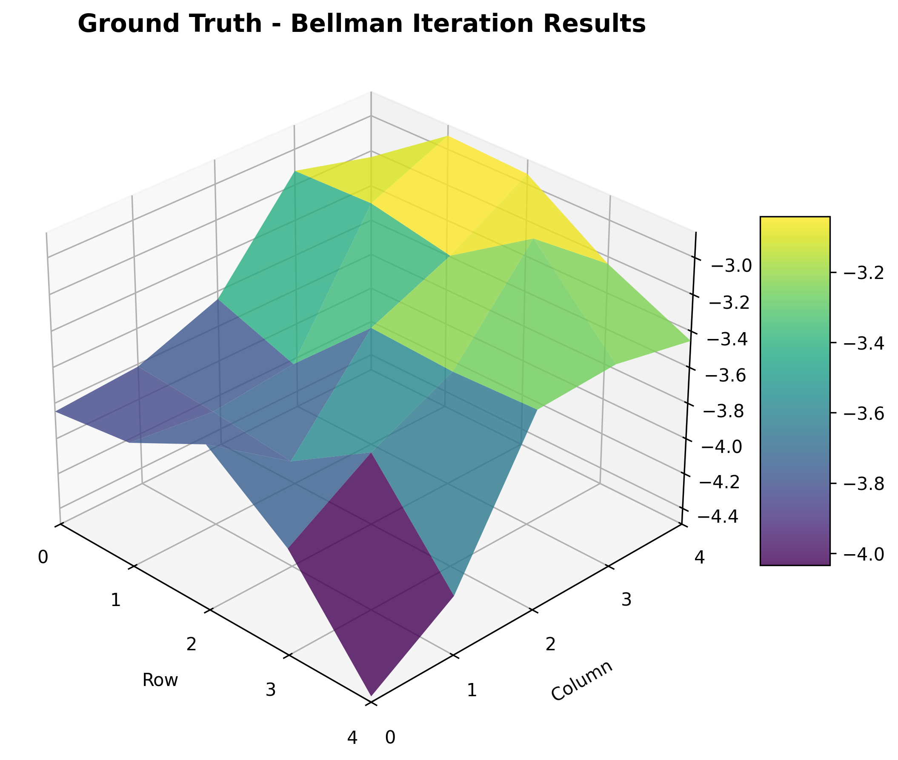
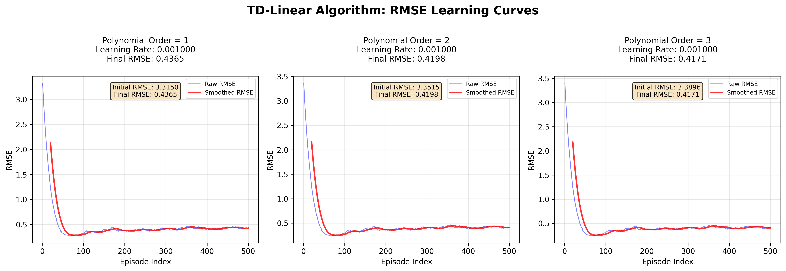

# 值函数逼近（Value Function Approximation）实验

本章节实现并比较了若干基于函数逼近的值函数学习与控制方法（线性特征的 TD、基于特征的 Q-learning / SARSA 等），并在网格世界（Grid World）环境中可视化每种方法学到的状态值与策略。支持可配置的环境、特征抽取器和可视化输出，便于多算法比较与训练曲线分析。

## 文件结构

```bash
Chapter7_Value_Function_Approximation/
├── experiment_one_results/
│   └── (png, csv 等实验一输出)
├── scripts/
│   └── chapter7_experiment_one.sh
├── src/
│   ├── experiment_one/
│   │   ├── experiment.py
│   │   └── visualization.py
│   └── experiment_two/
│       ├── experiment.py
│       ├── visualization.py
│       └── algorithms/
│           ├── __init__.py
│           ├── feature_extractor.py
│           ├── qlearning_agent.py
│           ├── sarsa_agent.py
│           └── results/
└── README.md
```

## 快速开始

运行实验一（生成实验一的可视化结果）：

```bash
bash Chapter7_Value_Function_Approximation/scripts/chapter7_experiment_one.sh
```

运行实验二（直接运行 Python 脚本产生图像）：

```bash
python Chapter7_Value_Function_Approximation/src/experiment_two/experiment.py
# 或者在仓库根目录的快捷脚本：
bash chapter7_experiment_two.sh
```

## 算法实现

### 1. 线性 TD（TD(0) / TD(λ) 的线性版本）
- 使用线性特征对值函数进行逼近，采用时序差分更新权重向量。

### 2. 基于特征的 Q-Learning
- 在线更新线性函数逼近下的 Q 值表征，结合 ε-greedy 行为策略。

### 3. 基于特征的 SARSA
- 在线 SARSA 更新结合线性特征，用于在策略评估与改进间实现稳定训练。

### 4. 特征提取器
- 提供简单的手工特征（位置编码、距离特征等），便于比较不同特征组合对学习效果的影响。

### 5. 策略评估与可视化工具
- `policy_evaluator` 与 `visualization.py` 提供策略质量评估、状态值热力图、策略箭头图与训练曲线绘制。

## 实验结果

实验将生成多种可视化结果，用以展示不同方法的学习效果与训练过程。

### 多算法策略与状态值对比
比较各算法学习到的状态值与策略汇总：


### 状态值三维视图
三维展示状态值分布（示例）：



### 训练误差 / RMSE 曲线
展示随训练集对比的 RMSE / 收敛速度：


---
如需自定义参数（例如学习率、ε、特征类型或保存路径），请修改对应的 `experiment.py` 或 `visualization.py`。
