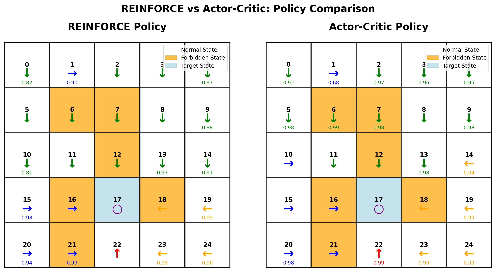
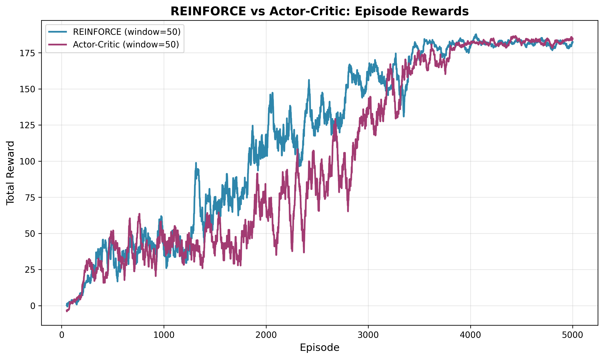
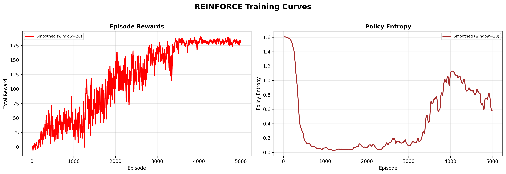
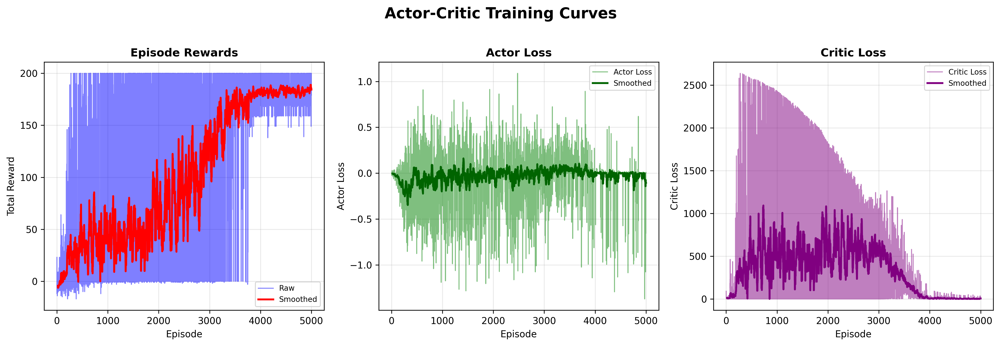

# Chapter 8: Policy Gradient Algorithm Experiment

<div align="right">

[English](README_en.md) | [简体中文](README.md)

</div>

## Introduction

### **Basics of Policy Gradient Algorithms**

Policy gradient algorithms are a class of reinforcement learning algorithms that directly optimize the policy by parameterizing the policy function and updating parameters in the direction of the gradient of the policy performance. Unlike value-based methods, policy gradient methods directly learn the optimal policy, avoiding bias in value function estimation, and are particularly suitable for continuous action spaces and high-dimensional state space problems.

### **REINFORCE Algorithm**

The REINFORCE (Monte Carlo Policy Gradient) algorithm is a policy gradient method based on complete trajectory returns. It samples complete trajectories to calculate cumulative returns and uses these returns as weights to update policy parameters. The algorithm improves learning stability by introducing a baseline function (such as a state value function) to reduce the variance of gradient estimates. REINFORCE forms the foundation of policy gradient methods and provides a theoretical framework for subsequent algorithms like Actor-Critic.

### **Actor-Critic Algorithm**

The Actor-Critic algorithm combines the advantages of policy gradient (Actor) and value function estimation (Critic). The Actor is responsible for selecting actions, while the Critic evaluates state values; the two work together to achieve more efficient policy optimization. The algorithm uses TD error or advantage functions as signals for policy updates, enabling single-step or n-step updates. This avoids the limitation of Monte Carlo methods requiring complete trajectories, thereby improving sample utilization and learning efficiency.

### Algorithm Implementation

This chapter implements the following policy gradient algorithm components in a Grid World environment to solve for the optimal policy:

1. **REINFORCE Algorithm Implementation**
   - A model-free reinforcement learning algorithm based on Monte Carlo policy gradients.
   - Updates policy parameters using complete episode returns.
   - Supports a baseline to reduce variance and improve learning stability.

2. **Actor-Critic Algorithm Implementation**
   - A method combining policy gradient (Actor) and value function (Critic).
   - Uses TD error as a signal for policy updates.
   - Supports advantage function estimation, balancing exploration and exploitation.

3. **Policy Network Architecture**
   - Supports Multi-Layer Perceptron (MLP) architecture.
   - Configurable hidden layer sizes and activation functions.
   - Softmax output layer for generating action probability distributions.

4. **Value Network Architecture**
   - Supports Multi-Layer Perceptron (MLP) architecture.
   - Configurable hidden layer sizes.
   - Outputs a single scalar value estimating state value.

5. **Feature Extractor Design**
   - **One-Hot Encoding**: Generates a unique one-hot vector for each state, providing stable optimization.
   - **Polynomial Features**: Expands state feature dimensions, but convergence difficulty should be noted.

## File Structure
```bash
Chapter8_Policy_Gradient/
├── results/ # Directory for storing experiment results
│ ├── actor-critic.training_curves.png # Actor-Critic algorithm training curve plot
│ ├── reinforce_training_curves.png # REINFORCE algorithm training curve plot
│ ├── reinforce_vs_actor-critic_episode_rewards.png # Return comparison plot for the two algorithms
│ └── reinforce_vs_actor-critic_policy_comparison.png # Policy comparison plot for the two algorithms
├── scripts/ # Directory for experiment scripts
│ └── chapter8_experiment.sh # Main experiment script to run the complete experiment with one command
├── src/ # Source code directory
│ ├── algorithms/ # Algorithm implementation module
│ │ ├── init.py # Module initialization file
│ │ ├── reinforce_agent.py # REINFORCE algorithm implementation
│ │ ├── actor_critic_agent.py # Actor-Critic algorithm implementation
│ │ ├── policy_network.py # Policy network implementation
│ │ └── feature_extractor.py # Feature extractor implementation
│ ├── experiment.py # Main file for running experiments and parameter configuration
│ └── visualization.py # Module for data visualization and chart generation
└── README.md # Main project documentation
```
## Quick Start

Run the experiment
```bash
bash Chapter8_Policy_Gradient/scripts/chapter8_experiment.sh
```

## Parameter Configuration

The following are the key parameters used in the experiment and their meanings:

| Parameter | Default Value | Description |
|-----------|---------------|-------------|
| **GridWorld Environment Configuration** | | |
| **SIZE** | 5 | Dimension of the grid world, creates a 5×5 square grid |
| **GAMMA** | 0.9 | Discount factor for future rewards |
| **FORBIDDEN_STATES** | "6 7 12 16 18 21" | List of forbidden/blocked states |
| **TARGET_STATES** | "17" | List of target/terminal states |
| **R_BOUND** | -1 | Immediate reward received upon hitting the grid boundary |
| **R_FORBID** | -1 | Immediate reward received upon entering a forbidden state |
| **R_TARGET** | 10 | Immediate reward received upon reaching the target state |
| **R_DEFAULT** | 0 | Default immediate reward for normal state transitions |
| **NUM_EPISODES** | 5000 | Total number of training episodes |
| **MAX_STEPS** | 20 | Maximum step limit per episode |
| **Algorithm Hyperparameters** | | |
| **HIDDEN_SIZE** | 128 | Neural network hidden layer size |
| **LEARNING_RATE** | 0.001 | Learning rate parameter controlling the magnitude of each update |
| **SEED** | 42 | Random seed |
| **FEATURE_TYPE** | "one_hot" | Type of feature extraction, options: "one_hot" or "polynomial" |
| **Actor-Critic Specific Parameters** | | |
| **GAE_LAMBDA** | 0.95 | λ parameter for Generalized Advantage Estimation (GAE) |


## Experimental Results

The experiment will generate four types of visualization analysis charts, comprehensively showcasing the learning effectiveness and training process dynamics of the REINFORCE and Actor-Critic policy gradient algorithms.

### 1. REINFORCE vs. Actor-Critic Policy Comparison Plot
Visually compares the final learned policies of the two algorithms through action arrow distributions in a 5×5 grid world:
- **Grid Structure**: Clearly displays the 5×5 grid layout.
- **Policy Arrows**: Each cell shows the learned action policy via arrow direction (up/down/left/right/stay).
- **Special State Markers**:
  - Target state: Highlighted in blue.
  - Forbidden state: Highlighted in orange.
- **Comparative Analysis**: Displays policy distributions of both algorithms side-by-side for easy comparison of policy differences.


*This plot shows the specific policy choices learned by the two algorithms under the same environmental conditions, facilitating analysis of policy convergence.*

### 2. Dual Algorithm Training Return Comparison Plot
Compares the training process dynamics of the two algorithms through a curve plot:
- **Blue Curve**: REINFORCE algorithm episode return convergence curve.
- **Purple Curve**: Actor-Critic algorithm episode return convergence curve.
- **Common Features**:
  - X-axis: Training episode number.
  - Y-axis: Cumulative return per episode.
  - Includes moving average line (smoothing window).
  - Shows convergence speed and stability comparison.


*This plot visually compares the return convergence trends and stability performance of the two algorithms during training.*

### 3. REINFORCE Algorithm Training Process Analysis
Deep analysis of the REINFORCE algorithm's training dynamics, containing two key metrics:
- **Left Plot**: Trend of cumulative episode return.
  - Shows the learning process from exploration to convergence.
  - Reflects the gradual improvement of policy performance.
- **Right Plot**: Trend of policy entropy.
  - Quantifies the degree of policy exploration.
  - Decreasing entropy reflects increasing policy determinism.
  - Helps analyze the exploration-exploitation balance.


*This plot provides a comprehensive analysis of the REINFORCE algorithm's learning dynamics from the dimensions of return and exploration.*

### 4. Actor-Critic Algorithm Training Process Analysis
Deep analysis of the Actor-Critic algorithm's training dynamics, comprehensively evaluating algorithm performance from three key dimensions:

- **Left Plot: Episode Cumulative Return Convergence Process**
  - Shows the unique learning trajectory and convergence characteristics of the Actor-Critic algorithm.
  - Reflects the accelerating effect of the Critic network on policy optimization.

- **Middle Plot: Actor Loss Function Change**
  - Tracks the evolution trend of the policy gradient loss (Actor loss).

- **Right Plot: Critic Loss Function Change**
  - Monitors the change pattern of the value function loss (Critic loss).
  - Reflects the improvement in the Critic network's accuracy in estimating state values.
  - Loss convergence indicates the Critic can provide stable TD error signals.



*This plot comprehensively showcases the performance characteristics of the Actor-Critic algorithm in terms of return convergence and exploration balance.*
